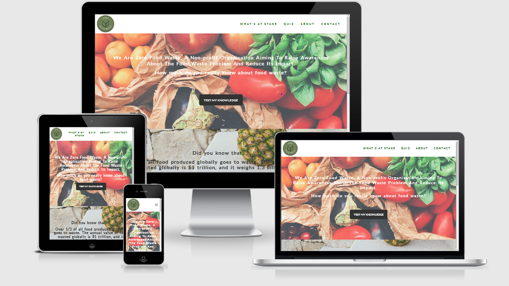

# Code Institute: Milestone Project 2

 
Zero Food Waste is a non-profit association whose mission is to contribute to reducing Global Food Waste. For this purpose 1)it allows companies like restaurants and supermarkets that want to donate food to get in touch through it with charities and other organisations that could use this food. 2) Offers information and a newsletter to raise awareness about this problem and inform users about related events.
The website provides general statistics and information about Worldwide Food Waste and their future predictions. A quiz to keep users engaged while learning. Also uses the Google Maps API to display the countries that waste the most food globally. The who are we? Page contains info about the company; its history, mission & values and their current & future actions to fight this problem.

## Organisation Goals:
•	Increase Brand Awareness and Brand Image.
•	Get as many entities and people as possible to contact the company for exchanges of food, possible collaborations, and events. 
•	Grant access to visitors to relevant Food Waste statistics that will raise their awareness about the topic and contribute to reduce their ecological print.

### Customers goals:
•	Get educated about Food Waste worldwide, learning how to reduce their environmental impact.
•	Having the opportunity to collaborate in related campaigns to make a bigger impact (for example donating food).
•	Being able to get in touch with the organisation for additional collaborations and suggestions.

## User Stories
Users want to:
Be able to contact the company to donate (businesses) or receive donated food (charities). 
Get exposed to relevant information that raise awareness of the Food Waste problem and motivate people to waste less food. 
Get Quizzed about this topic and learn new info in an enjoyable way (Quiz, Page). 
Get Information about the organisation; it history, accomplishments and future plans. 
Be able to reach out Zero Food Waste through a form for collaborations and general queries. 
Have the option to sign up for the newsletter to receive invitations to special events and tips about how to reduce Food Waste.

## Website Structure
Each page features a responsive navigation bar with the logo (top left) and a menu to access the pages of the site. Each page has also a footer with social media links and the logo to have the possibility to go back to the home page.

### Home.
At the top, the website talks about the quantity of food that gets wasted every year and the amount of people it could feed to draw the attention of visitors.
Below, there is another block of information with general data and under it a summary of the company mission.
At the bottom there is a menu to access other relevant sections for users: Learn More to get to the What’s at Stake page, Donate, Sign Up for the Newsletter and Quiz my knowledge to access the game.

### What’s at Stake 
Talks about additional statistics and future predictions to compel users to take action and see for themselves how big the problem is.
Then the site displays the top 10 countries that waste the most food using Google Maps API.
Finally, there is a similar bottom menu to donate food/sign up for the newsletter or take the quiz.

### Quiz Page
General Quiz with 5 questions about Food Waste. Tests the knowledge of the visitors and gives them a final score based on the number of correct answers.
The goal of this page is to keep visitors engaged while learning in a fun way.
Below there is a bottom menu with the same options as the previous page.

### About Us
Information about what the company is about and its story. Also the actions is taking and will implement in the future to reduce Food Waste and their impact.

### Contact
Page with a contact form that allows visitors to reach out for food donating campaigns and subscribe to the newsletter to get frequent updates about potential interesting events and tips to lead a more sustainable life.
This page also lists important partnership to build trust and increase the odds of visitors taking actions.

## Existing Features

•	**Header Logo** – Present on every page, clicking on it allow users to access the home page.

•	**Header Navigation Bar** – Allows visitors to easily navigate all the website's pages and access the desired section/information.

•	**Footer** – Social Media Links and logo to go back to the home page.

•	**Informational Blocks** – Relevant Food Waste Statistics.
•	**Entity Info** – The section about us features diverse info about the organisation.
•	**Contact Form** - Allows visitors to collaborate and/or subscribe to the newsletter.
•	**Sections Menu** - At the bottom of several pages there is a menu of possible actions to take. The aim of it is to spend more time on the site and ultimately get more donations/newsletter subscriptions.
•	**Quiz** - Tests visitor knowledge and gives them a score based on their number of correct answers.
•	**Google Maps Section** - Shows the biggest worldwide contributors to the Food Waste problem.

## Features to Implement in the future

• An Events Page with external and internal events visitors can attend (Conferences, Meetups, Fairs, etc).
• Extend it to Waste Recycle and facilitate ways for people to recycle more.
• A Personalised Section with Log In/Sign Up functions. There businesses can publish ads about Food they want to donate and get in touch with charities/NGOs.

## Wireframes

### Home Page
   

### Join Page

   
### Classes Page
   

### Contact Page

## Technologies Used
•	HTML, CSS & JavaScript Programming Languages

•	GitPod – Used as the Development IDE.

•	Bootstrap4 layout to make the form responsive, used a CDN to include it in the project.

•	FontAwesome: Great Icons Resource.

•	Auto-Prefixer: Extension that adds all necessary extensions to the webite so that it works properly on all major browsers.

•	Unsplash: Website that offers high quality free images.

•	Realfavicongenerator: Used to create the Favicon.

•	FreeLogoDesign: Tool used to design the logo.

•	Pencil: Great Wireframing Software.
•	EmailJS: To make the form work and receive visitors requests.

## Testing
### User Story Testing 

• Be able to contact the company to donate (businesses) or receive donated food (charities). 
It can be done through the form by selecting the preferred option. Visitors can also send a message with it.
• Get exposed to relevant information that raise awareness of the Food Waste problem and motivate people to waste less food. 
The city is full of related information, users can get quizzed about it and also get additional info through the newsletter.
• Get Quizzed about this topic and learn new info in an enjoyable way (Quiz, Page). 
The quiz section allows user to do it getting feedback through their score.
•  Get Information about the organisation; its history, accomplishments and future plans. 
All of it displayed in the About Us section.
•  Be able to reach out Zero Food Waste through a form for collaborations and general queries. 
Can be done through the main form.
•  Have the option to sign up for the newsletter to receive invitations to special events and tips about how to reduce Food Waste.
Same as previous user story.

## Responsiveness
•	**Header Logo** 
•	**Header Navigation Bar** 
•	**Footer** 
•	**Informational Blocks** 
•	**Entity Info** 
•	**Contact Form** 
•	**Sections Menu** - 
•	**Quiz** - 
•	**Google Maps Section** 

## Links and images
All links function and all images are in the Gitpod repository.

## Bugs & Problems
•	It took me a while to format properly the text boxes.

## Deployment
The website was developed using GitPod, committed to git and pushed to GitHub. It was then deployed with Github pages from its GitHub repository following these steps:
•	Log in into GitHub.

•	Select the repository and open settings.

•	Scroll down to the GitHub Pages section and click Master Branch. With this, the website is deployed.

•	Go to the GitHub pages section to get the website link.

## Cloning

•	Type ‘cd’ in the terminal followed by the desired directory name where 
it will get cloned.

•	Click on ‘Code’ (the green drop-down button on the top of the page).

•	Copy the last link and type and type ‘git clone’ followed by the copied name.

## Content
•	Social Media Icons are from Font Awesome.

•	Bootstrap Navbar Documentation helped me to create the navigation menu.

## Media
•	Pictures are from Unsplash.com and Google Images.
•	The favicon was created using the resource 

## Code

## Acknowledgements
•	I would like to thank my mentor Narender Singh, who was of great help in this project and was always really willing to help me and giving me useful feedback to get the most out of my project.

•	I checked projects from other students to get an idea of the scope of the project and as inspiration for my project.

## Disclaimer
This is a fictional company and was created as my MS2 Code Institute Project.
